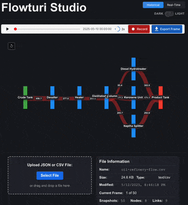

# Flowturi Studio

Flowturi Studio is a visualization tool for animated Sankey diagrams with both historical and real-time capabilities.

## Features

- Visualize energy or resource flows in a Sankey diagram
- Historical mode: upload and analyze JSON or CSV time-series data
- Real-time mode: connect to WebSocket streams for live data visualization
- Demo mode: easily load sample data files for demonstration
- Responsive design with light and dark themes
- Stable and consistent node positioning following design philosophy
- Export WebM animations or PNG single frames

## Demo



## Getting Started

1. Install dependencies:

   ```
   npm install
   ```

2. Start the development server:

   ```
   npm run dev
   ```

3. Open your browser to the URL displayed in the terminal (typically http://localhost:5173)

## Using Historical Mode

1. Select "Historical" in the mode toggle at the top of the application
2. Upload a JSON or CSV file with time-series Sankey data
3. Use the playback controls to navigate through the data frames

### Demo Mode

Flowturi includes a demo mode that allows easy loading of sample data files:

1. Enable demo mode by setting the `VITE_DEMO_MODE=true` environment variable
2. Sample data files will appear below the file upload section
3. Click any sample file to load it into the visualization

See [Demo Mode Documentation](docs/demo-mode.md) for more details.

## Using Real-Time Mode

1. Select "Real-Time" in the mode toggle at the top of the application
2. Enter the WebSocket URL of your data source in the WebSocket URL field
3. Click "Connect" to establish the WebSocket connection
4. The Sankey diagram will automatically update as new data arrives
5. Enable "Auto-reconnect" to automatically reconnect if the connection is lost

### Flowturi Real-Time Sandbox

Want to test Flowturi's Real-Time mode with some synthetic data? Check out the [flowturi-realtime-sandbox](https://github.com/ThatOrJohn/flowturi-realtime-sandbox) repo! It's a handy setup that generates test data and streams it to WebSocket clients. The sandbox uses **Docker Compose to spin up all the services** (including Node.js, Apache Flink, and Kafka, depending on your mode).

## Data Format

### Historical mode expects data in the following format:

```json
{
  "timestamp": "2023-05-10 15:30:00",
  "tick": 1,
  "nodes": [
    { "id": "Source1", "label": "Source 1" },
    { "id": "Target1", "label": "Target 1" }
  ],
  "links": [{ "source": "Source1", "target": "Target1", "value": 10 }]
}
```

```csv
timestamp,source,target,value
2025-05-10 00:00:00,Crude Tank,Desalter,456.7
2025-05-10 00:00:00,Desalter,Heater,277.04
```

### Expected Real-Time WebSocket Data Format

The WebSocket stream should send data in the following format:

```json
[
  {
    "timestamp": "2023-05-10T15:30:00Z",
    "tick": 1,
    "nodes": [{ "name": "Source 1" }, { "name": "Target 1" }],
    "links": [{ "source": "Source1", "target": "Target1", "value": 10 }]
  }
]
```

Note, the timestamp should be fairly flexible. Basically, whatever works with [Javascript's](https://developer.mozilla.org/en-US/docs/Web/JavaScript/Reference/Global_Objects/Date/parse) `new Date(timestamp)`. To be safe you could stick with ISO 8601 or millisecond timestamps.

### Real-Time Mode Behavior and Best Practices

#### How Real-Time Updates Work

- Each WebSocket message is processed independently as it arrives
- The Sankey diagram shows the most recent data frame without aggregation
- Frame transitions use smoothing to maintain visual stability between updates
- Up to 100 most recent frames are retained in memory for historical review

#### Recommendations for Optimal Results

- **Update Frequency**: Send data at a rate appropriate for human perception (1-5 updates per second is typically sufficient)
- **Data Aggregation**: For rapidly changing metrics, consider aggregating data on the server side before sending
- **Consistent Node Structure**: Try to maintain a consistent set of nodes across updates to prevent excessive visual reorganization
- **Batching**: For high-frequency sources, batch data over a reasonable interval (e.g., 200-500ms) to avoid overwhelming the visualization
- **Tick Property**: Use the optional `tick` property to help the visualization engine track frame sequencing

#### Performance Considerations

- Very high update frequencies (>10 frames/second) may cause rendering performance issues
- Extremely large node/link structures (>100 nodes) may impact responsiveness
- Responsiveness will vary based on the client's hardware capabilities

## Development

Flowturi follows a specific design philosophy for Sankey diagrams which is documented in:

- `docs/sankey-philosophy.md`
- `docs/sankey-layout-strategy.md`

The real-time mode implementation follows the strategy outlined in these documents to ensure stability,
readability, and smooth transitions.

## License

MIT
